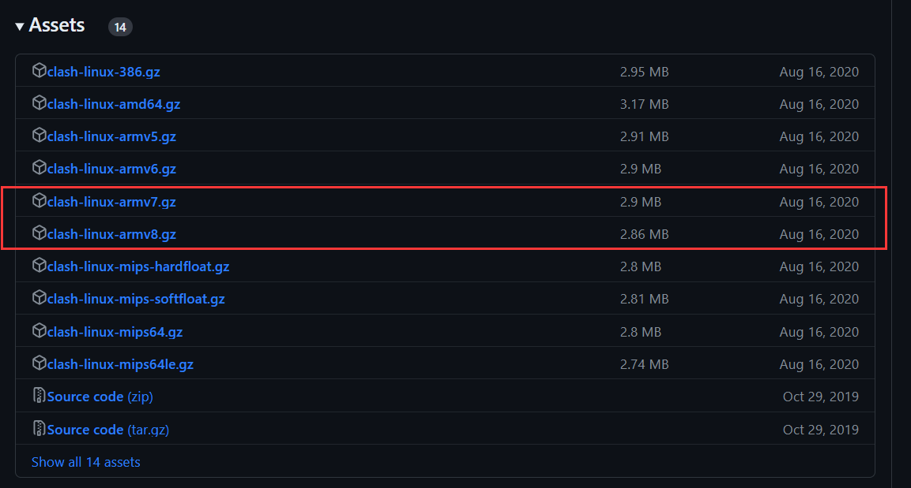
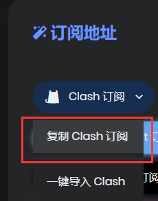
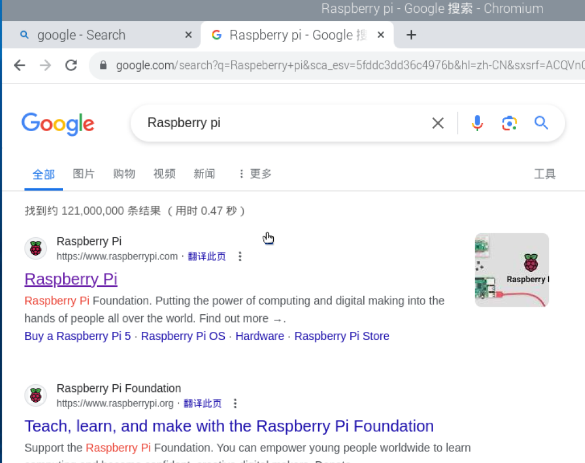
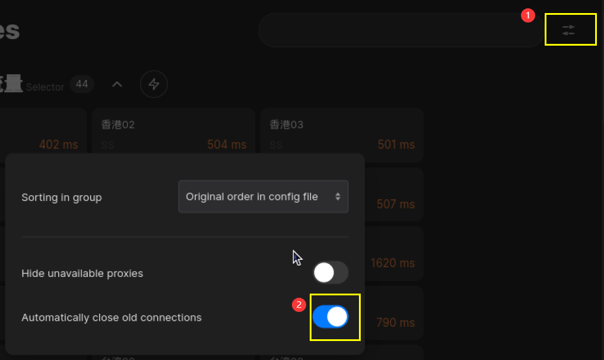
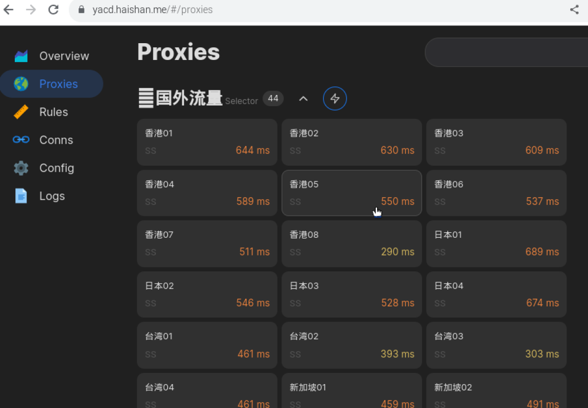

# 树莓派4B_linux clash部署教程

> 只为留个备份资料

# 0 使用情况介绍
* 硬件：树莓派4B
* 烧录系统 ："Bookworm", released on 11th October 2023
* Python 3.11.2
* VScode SSH-remote 连接 Raspberry Pi
# 1 下载Clash
## 1.1 为什么选择clash
之前在windows和Android设备都有使用过clash，感觉很流畅。其跨平台兼容性、用户友好的图形界面、灵活的配置选项都做得很好，并且支持多种代理协议，如Shadowsocks、Vmess等，可以能够根据规则智能地分流网络请求，优化网络访问速度和稳定性。此外，它还支持自动代理和直连规则，可以根据需要自定义，满足各类特定需求。
## 1.2 下载clash
首先需要了解清楚自己树莓派的操作系统位数。在树莓派命令行中输入
```Bash
uname -m
```
根据不同的返回值判断系统位数和所需clash版本，如下表所示。
| 返回值 | 操作系统位数 | 所需下载的clash版本 |
| :--- | :---: | :---: |
| armv7l | 32位 | [clash-linux-armv7.gz](https://github.com/frainzy1477/clash_dev/releases/download/v1.1.0/clash-linux-armv7.gz) |
| aarch64 或 armv8 | 64位 | [clash-linux-armv8.gz](https://github.com/frainzy1477/clash_dev/releases/download/v1.1.0/clash-linux-armv8.gz) |

其他版本可通过[此链接](https://github.com/frainzy1477/clash_dev/releases)获取


下载指令（以64位系统为例) 

```Bash
wget https://github.com/frainzy1477/clash_dev/releases/download/v1.1.0/clash-linux-armv8.gz
```
解压下载文件  
```Bash
gunzip clash-linux-armv8.gz   
```
将解压好的clashclash-linux-armv8文件更名为clash，移动到/usr/local/bin文件夹下，同时给予执行权限
```Bash
mv clash-linux-armv8 clash
sudo mv clash /usr/local/bin
sudo chmod a+x /usr/local/bin/clash
```
# 2 配置clash
## 2.1 下载clash配置文件
```
wget -O config.yaml [订阅链接]
```
订阅链接请从魔法后台寻找



## 2.2 下载clash全球IP库
Clash配置需要下载Country.mmdb 文件，Country.mmdb 是全球 IP 库，可以实现各个国家的IP信息解析和地理定位，没有这个文件clash无法正常启动下载指令
```
wget -O Country.mmdb "https://raw.githubusercontent.com/SukkaW/Koolshare-Clash/master/koolclash/koolclash/config/Country.mmdb"
```
## 2.3 放置配置文件
在.config文件夹下新建clash文件夹
```
cd .config
mkdir clash
```
将上述配置文件放置在.config/clash文件夹下面
```
mv config.yaml Country.mmdb clash/
```
# 3. 环境配置
回到主目录，通过对bashrc中文件进行修改来配置clash环境
```
cd
sudo nano .bashrc
```
在打开的bashrc文件最下方添加环境配置指令
```
export http_proxy="http://127.0.0.1:7890"
export https_proxy="http://127.0.0.1:7890"
export all_proxy="socks5://127.0.0.1:7891"
```
使环境指令生效
```
source .bashrc
```
重启树莓派，使配置生效。
```
sudo reboot
```
# 4 测试
## 4.1 启动clash   
重新开机后输入clash启动指令，在~/.config/clash目录下查找其配置文件
```
clash -d ~/.config/clash
```
如果返回类似下方内容证明成功启动
```
INFO[0000] Start initial compatible provider 💬chatGPT   
INFO[0000] Start initial compatible provider 🎬Netflix   
INFO[0000] Start initial compatible provider 🎵Spotify   
INFO[0000] Start initial compatible provider 🎬Youtube   
INFO[0000] Start initial compatible provider 🔰国外流量      
INFO[0000] Start initial compatible provider ⚓️其他流量     
INFO[0000] Start initial compatible provider ✈️Telegram 
INFO[0000] Start initial compatible provider 🎬国外媒体      
INFO[0000] Start initial compatible provider 🎬哔哩哔哩      
INFO[0000] Start initial compatible provider 🍎苹果服务      
INFO[0000] Start initial compatible provider 🎬Disney+   
INFO[0000] Start initial compatible provider 🚀直接连接
```
**注意：此时服务是一次性的,重新打开一个终端，不要关闭当前终端** 

## 4.2 与google建立连接（新开一个终端）
运行测试命令，尝试和google网页建立连接
```
curl www.google.com
```
**注意： ping 使用不同的协议无法被 Clash 代理，此处建议使用curl**    
       
如果返回类似下列输出
```
<!doctype html><html itemscope="" itemtype="http://schema.org/WebPage" lang="zh-HK"><head><meta content="text/html; charset=UTF-8" http-equiv="Content-Type"><meta content="/images/branding/googleg/1x/googleg_standard_color_128dp.png" itemprop="image"><title>Google</title><script nonce="aVQt8beVhovehWsJsUnAVA">(function(){var _g={kEI:'9fPlZfLmGPibvr0P84-64Ag',kEXPI:'0,18168,782154,565145,207,4804,1132070,1963,1,1195768,669,361,379728,44799,23792,12319,2816,14764,4998,55519,2872,2891,4140,7614,606,50058,10632,2614,3784,9707,230,20583,4,28691,28711,2215,27053,6621,7596,1,42154,2,39761,6700,31122,4568,6255,24673,30151,2913,2,2,1,24626,2006,8155,23350,22436,9779,42459,20198,23147,50032,3030,15816,1804,11488,4580,11025,19989,477,951,87,117,286,13209,37564,5215442,2,1390,821,72,4,83,5992595,2839003,6,27983126,16673,43886,3,1603,3,2121778,2585,22636438,398338,7374,8408,4503,9954,2208,13024,4427,10576,5878,17455,13537,1923,7290,1298,2370,6407,2870,10975,5521,7432,2212,149,2071,3055,2907,8134,3,558,1548,3,2998,672,2109,1720,5,126,3462,1624,2256,1897,137,1835,2246,306,156,879,580,1890,4476,3,4885,4,656,120,775,369,951,252,1537,257,1402,349,1464,3121,472,3277,8838,292,1502,359,296,301,49,1212,3,77,462,72,419,1908,185,738,904,331,36,355,129,26,405,2079,6,212,17,186,1080,1175,132,8,391,13,558,1,323,234,1,63,588,49,1518,2392,1103,963,1197,1155,102,213,29,593,2673,146,357,85,454,55,4,2034,55,315,436,324,8,311,14,568,4026,5,153,105,343,816,156,94,824,3,4,188,53,101,5,26,222,123,965,14,10,255,3,374,4,116,148,69,490,77,285,8,178,715,97,218,117,97,44,73,17,291,605,320,207,121,60,253,72,389,5,424,198,4,1,6,118,55,16,96,512,220,261,851,1499,477,186,12,520,22,6,1637,329,21679038,4264,3,5572,491,48,277',kBL:'6PLV',kOPI:89978449};(function()...
```
即证明和google连接成功
## 4.3  网页测试
此时我们在浏览器中输入www.google.com发现仍然长时间无法响应无法打开，需要指定浏览器的代理。    
此时，**关闭所有已打开的网页**，在命令行中输入
```
chromium-browser --proxy-server="http://127.0.0.1:7890"
```
即可自动打开浏览器，并且访问google没有问题,如图：  



# 5. Dashboard选择节点
在刚才打开的浏览器中输入Dashboard网址（以Yacd为例）：yacd.haishan.me  
打开如图勾选“自动断连旧链接”  



此时，便可以在proxies里面自由选择节点了



# 6 Clash开机自启动
我们可以使用 crontab 作为自动任务管理器，将clash启动作为系统默认任务。
输入以下命令打开 crontab：   
```
crontab -e
```

在末尾添加自启动指令：

```
@reboot /usr/local/bin/clash
```
保存后退出即可。  

# 参考资料：
感谢前人的引领，也希望本篇教程能帮助到更多人~   
1. [Xizhe-Hao/Clash-for-RaspberryPi-4B: 树莓派如何使用clash科学上网_2024版](https://github.com/Xizhe-Hao/Clash-for-RaspberryPi-4B)
